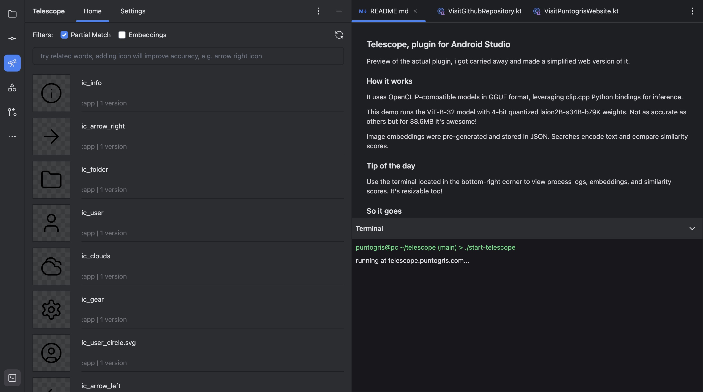

## Telescope Plugin for Android Studio (Apple Silicon Support Only)

Telescope is an Android Studio plugin designed to make finding drawables across all your modules simple and efficient.

**Note:** This plugin currently supports Apple Silicon devices only and is in an experimental stage.

## Features

Telescope has two search modes to help you find what you need:

- **Partial Match Search:** A simple and fast way to locate drawables by name.
- **AI-Powered Search (experimental):** Context-aware search using OpenCLIP models.

### Partial Match Search

This mode scans all modules, including nested ones, to find drawables based on partial matches in their names.

### AI-Powered Search (experimental)

The AI search is context-aware, so it can find relevant matches even with related terms, like finding `ic_pencil` when
searching for `edit` or `update`.

The plugin uses OpenCLIP-compatible models in the GGUF format for efficient and lightweight operation, specifically the
`ViT-B/32` model with `laion2B-s34B-b79K` weights. For inference, it leverages clip.cpp through JNI Java bindings.

## Try it out!

### Web version

I got carried away and made a simplified web version, check it out
at [telescope.puntogris.com](https://telescope.puntogris.com
). It includes a terminal where you can see logs in real-time.

*Don't let it fool you, this is the web version*

### Android Studio

The plugin isn’t published yet, but you can install it manually:

- Download the release version from the repo
- Clone the repo and run the `buildPlugin` gradle task to generate a .zip file

Then, in Android Studio go to Settings > Plugins > Gear Icon > Install Plugin from Disk, and select the .zip file

## TODO

- Check if it's worth migrating to the way ResourceManager fetches resources
- Fix crash in clip.cpp when encoding text multiple times in a short amount of time
- Publish it